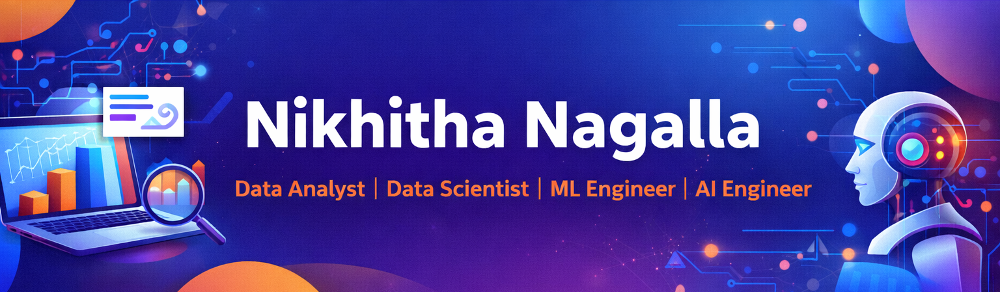

# Hi, I'm Nikhitha 👋
🎓 MS student focused on data-driven problem solving across analytics and machine learning, with strengths in turning raw, messy datasets into clean, reliable pipelines and clear insights. 🤝 I’m always open to collaborating with others and exploring new opportunities in Data Analyst, Data Scientist, and ML/AI Engineer roles.

## ✨ Highlights
- 🔍 Strong in **EDA, data cleaning, and storytelling** - turning raw data into clear insights & recommendations  
- 🧠 Built **ML/CV models** with solid evaluation practices (metrics, validation, error analysis)  
- 🛠️ Comfortable building **end-to-end pipelines**: ingestion → preprocessing → features → modeling → documentation  
- 📈 Create stakeholder-friendly outputs using **visualizations, notebooks, and well-structured reports**  
- 🤝 Team-friendly: enjoy **collaborating**, documenting work clearly, and improving projects iteratively  

## 🧰 Things I work with

## 🌟 Featured Projects

| 👁️ VisionSaver | 🌍 Climate-Disaster-Prediction-System |
|---|---|
| **Ocular disease detection using ML/CV** • End-to-end pipeline (prep → train → eval) • Metrics + error analysis **Tech:** Python, PyTorch/sklearn | **Prediction + analysis for climate/disaster risk** • EDA + feature engineering • Model training + evaluation **Tech:** Python, SQL, sklearn |
| 🔗 https://github.com/Nikhitha-N/VisionSaver | 🔗 https://github.com/Nikhitha-N/Climate-Disaster-Prediction-System |

## 📫 Connect
- ✉️ Contact me at Email: **nikhithanagalla@ufl.edu**
- 🌐 Check out my Portfolio: **https://nikhitha-n.github.io/Nikhitha_portfolio/**
-  LinkedIn: **https://www.linkedin.com/in/nikhitha13/**

